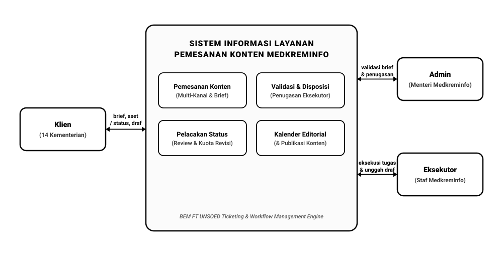
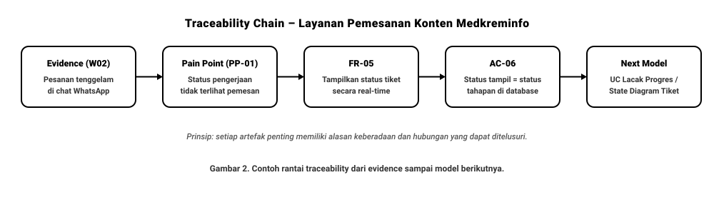

# SOFTWARE REQUIREMENTS SPECIFICATION (SRS)
## Sistem Informasi Layanan Pemesanan Konten Medkreminfo BEM FT UNSOED
### Tugas 2 untuk IF21307 – Analisis dan Desain Sistem

| Metadata Dokumen | Keterangan |
|---|---|
| **Status Dokumen** | Draft untuk Penilaian Tugas 2 |
| **Versi** | 1.0 (Draft Baseline) |
| **Tanggal** | 02 Oktober 2026 |
| **Kasus** | Riil – Layanan Pemesanan Konten Medkreminfo BEM Fakultas Teknik Universitas Jenderal Soedirman |
| **Mata Kuliah** | IF21307 – Analisis dan Desain Sistem (Semester 3) |

---

### Tim Penyusun (Kelompok Proyek)
1. **Timotius Willy Narendra** (H1D025052) — Project Manager
2. **Fardizza Vinda Rahman** (H1D025067) — Analis Sistem
3. **Adridinan Najmi Faza** (H1D025059) — Pengembang Perangkat Lunak
4. **Salman Thufail** (H1D022109) — Pengembang Perangkat Lunak

---

## Daftar Isi
1. Pendahuluan
   * 1.1 Tujuan Dokumen
   * 1.2 Latar Belakang Kasus
   * 1.3 Tujuan Sistem
   * 1.4 Scope
   * 1.5 Definisi dan Singkatan
2. Deskripsi Umum Sistem
   * 2.1 Stakeholder dan Peran
   * 2.2 System Context
   * 2.3 Asumsi dan Constraint
3. Kebutuhan Fungsional
4. Kebutuhan Non-Fungsional
5. Business Rules
6. User Story dan Use Case Narrative
   * 6.1 User Story
   * 6.2 Use Case Narrative
7. Acceptance Criteria
8. Prioritas Kebutuhan
9. Requirement Traceability Matrix (RTM)
10. Baseline, Asumsi, dan Revision Notes
    * 10.1 Baseline Draft
    * 10.2 Open Issues / TBD
    * 10.3 Checklist Review SRS
* Referensi Acuan Pembelajaran
* Lampiran A. Bukti Discovery (Wawancara & Observasi)
* Lampiran B. Pembagian Kontribusi Anggota Tim

---

## 1. Pendahuluan

### 1.1 Tujuan Dokumen
Dokumen Software Requirements Specification (SRS) ini merumuskan spesifikasi kebutuhan perangkat lunak untuk pembangunan Sistem Informasi Layanan Pemesanan Konten Kementerian Media, Kreatif, dan Informasi (Medkreminfo) BEM FT UNSOED. Dokumen ini menjadi acuan formal antara stakeholder pengguna (Menteri Medkreminfo, staf eksekutor, dan 14 kementerian pemesan) dengan tim pengembang untuk memastikan seluruh kebutuhan yang terelisitasi bersifat terstruktur, tidak ambigu, dapat diuji (*testable*), diprioritaskan, dan dapat ditelusuri (*traceable*) ke artefak analisis dan desain berikutnya.

### 1.2 Latar Belakang Kasus
Pada alur kerja *as-is* saat ini, 14 kementerian di lingkungan BEM FT mengajukan permohonan publikasi konten media sosial secara manual melalui pesan WhatsApp pribadi kepada staf penanggung jawab (PJ) Medkreminfo atau ke grup perpesanan. Berdasarkan hasil wawancara dengan perwakilan Medkreminfo (Sdr. Aba Ibrahim) pada 7 September 2026, alur desentralistis ini menimbulkan sejumlah masalah kritis:
1. Permintaan konten tenggelam di riwayat percakapan pribadi sehingga terlambat atau lupa dikerjakan.
2. Sering terjadi kesalahpahaman tenggat waktu (*deadline*) dan kesalahan spesifikasi format antar kanal (misal poster 1:1 dipotong menjadi Story 9:16).
3. Distribusi beban kerja staf tidak merata karena hanya bergantung pada keaktifan kementerian yang dipegang oleh masing-masing PJ.
4. Tidak ada rekam jejak revisi dan kalender publikasi terpadu, memicu benturan jadwal tayang antar kementerian.

### 1.3 Tujuan Sistem
1. Menyediakan platform pengajuan permohonan (*ticketing system*) terpusat berbasis formulir adaptif multi-kanal.
2. Memfasilitasi validasi kelayakan *brief* dan pembagian tugas (*assignment*) yang seimbang oleh Menteri Medkreminfo berdasarkan spesialisasi keahlian staf.
3. Memberikan transparansi pemantauan status proses pengerjaan konten secara *real-time* bagi kementerian pemesan.
4. Mengelola siklus evaluasi dan pembatasan revisi karya secara terstruktur.
5. Menyajikan visualisasi kalender publikasi editorial guna mencegah benturan slot publikasi media sosial.

### 1.4 Scope
* **In Scope:**
  * Pengelolaan akun dan hak akses pengguna berbasis peran (Admin/Menteri, Eksekutor/Staf, Klien/14 Kementerian).
  * Pengajuan formulir pemesanan multi-kanal (Instagram Feeds, Instagram Story, LinkedIn, dan TikTok).
  * Validasi kelayakan brief dan kepatuhan aturan batas waktu minimum pengajuan (*Service Level Agreement* / SLA).
  * Pengunggahan dan pengelolaan berkas aset pendukung (gambar, naskah, hingga berkas video > 50 MB untuk TikTok) dengan kebijakan pembersihan berkas fisik otomatis (*auto-purge*) pada server setelah status tiket menjadi *Published* demi efisiensi kuota hosting.
  * Disposisi penugasan staf (*workload balancing*) dan pengalihan tugas (*re-assignment*).
  * Pembaruan status pengerjaan bertahap (*lifecycle tracking*) dan pengunggahan berkas draf luaran.
  * Mekanisme peninjauan draf, pembatasan kuota revisi minor (maksimal 2 kali), dan persetujuan akhir (*final approval*).
  * Visualisasi jadwal tayang terpadu pada kalender editorial.
  * Pencatatan tautan bukti konten terbit (*Published*) di media sosial resmi.
* **Out of Scope (pada fase ini):**
  * Auto-posting otomatis ke antarmuka pemrograman aplikasi (API) Instagram Graph, LinkedIn, atau TikTok (publikasi akhir tetap dieksekusi manual oleh staf pengelola media sosial).
  * Penyediaan modul perancangan grafis atau pengeditan video di dalam peramban web (*in-app editor*).
  * Manajemen moderasi percakapan langsung (*Direct Message*), balasan komentar warganet, dan analitik interaksi media sosial.
  * Transaksi komersial berbayar atau layanan pemesanan untuk organisasi luar di luar BEM FT.

### 1.5 Definisi dan Singkatan

| Istilah / Singkatan | Definisi |
|---|---|
| **SRS** | *Software Requirements Specification*; dokumen spesifikasi kebutuhan perangkat lunak. |
| **RTM** | *Requirements Traceability Matrix*; matriks penelusuran kebutuhan sistem ke sumber dan artefak desain. |
| **FR** | *Functional Requirement*; pernyataan fungsi atau perilaku layanan yang wajib disediakan sistem. |
| **NFR** | *Non-Functional Requirement*; batasan kualitas layanan sistem (performa, keamanan, keandalan). |
| **BR** | *Business Rule*; aturan tata kelola proses bisnis organisasi yang membatasi operasional sistem. |
| **AC** | *Acceptance Criteria*; kriteria pengujian penerimaan untuk memvalidasi terpenuhinya suatu kebutuhan. |
| **SLA** | *Service Level Agreement*; batas waktu durasi pengajuan minimum sebelum tanggal publikasi tayang. |
| **Brief** | Rincian instruksi konsep pesan, preferensi visual, salinan naskah, aset materi, dan tenggat waktu. |
| **Klien** | Akun pengguna resmi perwakilan salah satu dari 14 kementerian di lingkungan BEM FT. |
| **Eksekutor** | Staf teknis Medkreminfo (desainer grafis, editor video, atau copywriter). |
| **Admin** | Menteri atau Sekretaris Kementerian Medkreminfo yang memegang wewenang manajerial publikasi. |
| **Auto-Purge** | Mekanisme penghapusan berkas fisik aset/video pada server lokal setelah tiket selesai dipublikasikan guna menghemat kapasitas penyimpanan. |

---

## 2. Deskripsi Umum Sistem

### 2.1 Stakeholder dan Peran

| Stakeholder / Peran | Kepentingan | Interaksi Utama dengan Sistem |
|---|---|---|
| **Klien (Perwakilan 14 Kementerian)** | Mengajukan kebutuhan publikasi proker secara tertata, memperoleh kepastian waktu pengerjaan, dan memantau progres tanpa tanya manual via WA. | Mengisi form pengajuan multi-kanal, mengunggah materi/video, memantau status tiket, mengajukan revisi draf, memberikan persetujuan akhir. |
| **Admin (Menteri / Sekretaris Medkreminfo)** | Menjaga kualitas konten publikasi organisasi, membagi beban kerja staf secara merata, dan mencegah benturan jadwal posting. | Meninjau kelayakan brief, menyetujui/menolak tiket, menetapkan staf pelaksana, memantau *workload*, mengatur kalender editorial. |
| **Eksekutor (Staf Medkreminfo)** | Menerima brief dan aset lengkap di satu tempat, terhindar dari revisi tak berujung, dan fokus pada eksekusi karya. | Melihat antrean tugas pribadi, mengunduh aset, memperbarui status tiket, mengunggah draf karya v1/v2, membaca catatan revisi. |
| **Pimpinan BEM (Ketua / Wakil Ketua)** | Memastikan seluruh informasi kegiatan BEM terpublikasi secara profesional dan terukur. | Memantau rekap capaian publikasi dan kalender agenda tayang secara periodik. |

### 2.2 System Context
Sistem Informasi Layanan Pemesanan Konten beroperasi sebagai sistem aplikasi berbasis web terpusat. Klien dari 14 kementerian menginput data *request* dan aset lampiran. Sistem memproses validasi kepatuhan SLA (BR-01) dan menyimpannya dalam basis data. Admin mengakses antarmuka manajerial untuk validasi dan penugasan ke Eksekutor. Eksekutor mengunggah draf hasil pekerjaan yang kemudian dapat diakses kembali oleh Klien untuk peninjauan.



*Gambar 1. Diagram konteks konseptual Sistem Informasi Layanan Pemesanan Konten Medkreminfo (Monokrom/Hitam Putih).*  
Diagram ini disajikan dalam format monokrom (hitam-putih) standar dokumen teknis/SRS. Berkas sumber diagram berbasis XML dapat diakses melalui berkas Draw.io XML [diagram_system_context.drawio](diagram_system_context.drawio) / [diagram_system_context.xml](diagram_system_context.xml) serta berkas vektor [diagram_system_context.svg](diagram_system_context.svg). Detail BPMN, use case diagram, activity diagram, dan sequence diagram merupakan artefak lanjutan yang melengkapi paket analisis pada pertemuan selanjutnya.

<details>
<summary><b>Kode XML Draw.io - Gambar 1 (Klik untuk melihat/menyalin)</b></summary>

```xml
<mxfile host="app.diagrams.net" agent="Antigravity" version="24.0.0">
  <diagram name="Diagram Konteks - Medkreminfo" id="diagram_context_medkreminfo">
    <mxGraphModel dx="1200" dy="700" grid="1" gridSize="10" guides="1" tooltips="1" connect="1" arrows="1" fold="1" page="1" pageScale="1" pageWidth="1050" pageHeight="560" background="#ffffff" math="0" shadow="0">
      <root>
        <mxCell id="0" />
        <mxCell id="1" parent="0" />
        <mxCell id="system_container" parent="1" style="rounded=1;whiteSpace=wrap;html=1;fillColor=#fbfbfb;strokeColor=#000000;strokeWidth=2;verticalAlign=top;spacingTop=20;fontSize=15;fontStyle=1;fontColor=#000000;" value="SISTEM INFORMASI LAYANAN&#xa;PEMESANAN KONTEN MEDKREMINFO" vertex="1">
          <mxGeometry x="290" y="50" width="420" height="410" as="geometry" />
        </mxCell>
        <mxCell id="func_pemesanan" parent="1" style="rounded=1;whiteSpace=wrap;html=1;fillColor=#ffffff;strokeColor=#000000;strokeWidth=1.5;fontSize=12;fontColor=#000000;align=center;" value="&lt;b&gt;Pemesanan Konten&lt;/b&gt;&lt;br&gt;&lt;font color=&quot;#333333&quot; style=&quot;font-size: 11px;&quot;&gt;(Multi-Kanal &amp;amp; Brief)&lt;/font&gt;" vertex="1">
          <mxGeometry x="315" y="145" width="175" height="70" as="geometry" />
        </mxCell>
        <mxCell id="func_validasi" parent="1" style="rounded=1;whiteSpace=wrap;html=1;fillColor=#ffffff;strokeColor=#000000;strokeWidth=1.5;fontSize=12;fontColor=#000000;align=center;" value="&lt;b&gt;Validasi &amp;amp; Disposisi&lt;/b&gt;&lt;br&gt;&lt;font color=&quot;#333333&quot; style=&quot;font-size: 11px;&quot;&gt;(Penugasan Eksekutor)&lt;/font&gt;" vertex="1">
          <mxGeometry x="510" y="145" width="175" height="70" as="geometry" />
        </mxCell>
        <mxCell id="func_pelacakan" parent="1" style="rounded=1;whiteSpace=wrap;html=1;fillColor=#ffffff;strokeColor=#000000;strokeWidth=1.5;fontSize=12;fontColor=#000000;align=center;" value="&lt;b&gt;Pelacakan Status&lt;/b&gt;&lt;br&gt;&lt;font color=&quot;#333333&quot; style=&quot;font-size: 11px;&quot;&gt;(Review &amp;amp; Kuota Revisi)&lt;/font&gt;" vertex="1">
          <mxGeometry x="315" y="245" width="175" height="70" as="geometry" />
        </mxCell>
        <mxCell id="func_kalender" parent="1" style="rounded=1;whiteSpace=wrap;html=1;fillColor=#ffffff;strokeColor=#000000;strokeWidth=1.5;fontSize=12;fontColor=#000000;align=center;" value="&lt;b&gt;Kalender Editorial&lt;/b&gt;&lt;br&gt;&lt;font color=&quot;#333333&quot; style=&quot;font-size: 11px;&quot;&gt;(&amp;amp; Publikasi Konten)&lt;/font&gt;" vertex="1">
          <mxGeometry x="510" y="245" width="175" height="70" as="geometry" />
        </mxCell>
        <mxCell id="system_footer" parent="1" style="text;html=1;align=center;verticalAlign=middle;fontSize=11;fontColor=#555555;fontStyle=2;" value="BEM FT UNSOED Ticketing &amp;amp; Workflow Management Engine" vertex="1">
          <mxGeometry x="290" y="420" width="420" height="25" as="geometry" />
        </mxCell>
        <mxCell id="actor_klien" parent="1" style="rounded=1;whiteSpace=wrap;html=1;fillColor=#ffffff;strokeColor=#000000;strokeWidth=2;fontSize=14;fontColor=#000000;align=center;" value="&lt;b&gt;Klien&lt;/b&gt;&lt;br&gt;&lt;font color=&quot;#333333&quot; style=&quot;font-size: 12px;&quot;&gt;(14 Kementerian)&lt;/font&gt;" vertex="1">
          <mxGeometry x="40" y="215" width="170" height="85" as="geometry" />
        </mxCell>
        <mxCell id="actor_admin" parent="1" style="rounded=1;whiteSpace=wrap;html=1;fillColor=#ffffff;strokeColor=#000000;strokeWidth=2;fontSize=14;fontColor=#000000;align=center;" value="&lt;b&gt;Admin&lt;/b&gt;&lt;br&gt;&lt;font color=&quot;#333333&quot; style=&quot;font-size: 12px;&quot;&gt;(Menteri Medkreminfo)&lt;/font&gt;" vertex="1">
          <mxGeometry x="790" y="115" width="170" height="85" as="geometry" />
        </mxCell>
        <mxCell id="actor_eksekutor" parent="1" style="rounded=1;whiteSpace=wrap;html=1;fillColor=#ffffff;strokeColor=#000000;strokeWidth=2;fontSize=14;fontColor=#000000;align=center;" value="&lt;b&gt;Eksekutor&lt;/b&gt;&lt;br&gt;&lt;font color=&quot;#333333&quot; style=&quot;font-size: 11.5px;&quot;&gt;(Staf Medkreminfo)&lt;/font&gt;" vertex="1">
          <mxGeometry x="790" y="305" width="170" height="85" as="geometry" />
        </mxCell>
        <mxCell id="conn_klien_sys" parent="1" source="actor_klien" target="system_container" style="edgeStyle=orthogonalEdgeStyle;rounded=0;orthogonalLoop=1;jettySize=auto;html=1;startArrow=classic;endArrow=classic;strokeColor=#000000;strokeWidth=1.5;fontSize=11;fontColor=#000000;align=center;verticalAlign=bottom;labelBackgroundColor=#ffffff;" value="brief, aset&#xa;/ status, draf" edge="1">
          <mxGeometry relative="1" as="geometry">
            <mxPoint x="210" y="257.5" as="sourcePoint" />
            <mxPoint x="290" y="257.5" as="targetPoint" />
          </mxGeometry>
        </mxCell>
        <mxCell id="conn_sys_admin" parent="1" source="system_container" target="actor_admin" style="edgeStyle=orthogonalEdgeStyle;rounded=0;orthogonalLoop=1;jettySize=auto;html=1;startArrow=classic;endArrow=classic;strokeColor=#000000;strokeWidth=1.5;fontSize=11;fontColor=#000000;align=center;verticalAlign=bottom;labelBackgroundColor=#ffffff;" value="validasi brief&#xa;&amp;amp; penugasan" edge="1">
          <mxGeometry relative="1" as="geometry">
            <mxPoint x="710" y="157.5" as="sourcePoint" />
            <mxPoint x="790" y="157.5" as="targetPoint" />
            <Array as="points">
              <mxPoint x="750" y="158" />
              <mxPoint x="750" y="158" />
            </Array>
          </mxGeometry>
        </mxCell>
        <mxCell id="conn_sys_eksekutor" parent="1" source="system_container" target="actor_eksekutor" style="edgeStyle=orthogonalEdgeStyle;rounded=0;orthogonalLoop=1;jettySize=auto;html=1;startArrow=classic;endArrow=classic;strokeColor=#000000;strokeWidth=1.5;fontSize=11;fontColor=#000000;align=center;verticalAlign=bottom;labelBackgroundColor=#ffffff;" value="eksekusi tugas&#xa;&amp;amp; unggah draf" edge="1">
          <mxGeometry relative="1" as="geometry">
            <mxPoint x="710" y="347.5" as="sourcePoint" />
            <mxPoint x="790" y="347.5" as="targetPoint" />
            <Array as="points">
              <mxPoint x="750" y="348" />
              <mxPoint x="750" y="348" />
            </Array>
          </mxGeometry>
        </mxCell>
      </root>
    </mxGraphModel>
  </diagram>
</mxfile>
```

</details>

### 2.3 Asumsi dan Constraint
1. Pengguna mengakses sistem menggunakan peramban web modern yang mendukung JavaScript, CSS3, dan transmisi berkas HTML5 melalui jaringan internet kampus.
2. Setiap kementerian di lingkungan BEM FT memiliki satu akun representatif resmi dengan kredensial yang terlindungi.
3. Penyimpanan server mendukung penanganan unggahan berkas media besar (seperti video TikTok > 50 MB) selama siklus produksi berjalan, dengan aturan pembersihan berkas fisik aset secara otomatis begitu pesanan dinyatakan selesai (*Published*).
4. Pimpinan BEM FT memberlakukan kepatuhan operasional bahwa seluruh pesanan publikasi wajib diproses melalui sistem (menolak pesanan via jalur pribadi).

---

## 3. Kebutuhan Fungsional

Functional Requirement (FR) mendefinisikan perilaku spesifik yang wajib diimplementasikan pada sistem. Setiap kebutuhan diberi kode sumber bukti elisitasi (*Evidence*) dan *Pain Point* agar dapat ditelusuri secara konsisten.

| ID | Requirement Statement | Source | Prioritas Awal |
|---|---|---|---|
| **FR-01** | Sistem harus memvalidasi kredensial pengguna (email/username dan password) serta mengarahkan pengguna ke antarmuka sesuai perannya (Admin, Eksekutor, Klien). | Analisis Hak Akses / BR-03 | High (Must) |
| **FR-02** | Sistem harus memungkinkan Klien membuat tiket pesanan baru melalui formulir terstruktur dengan memilih kanal tujuan (Instagram Feeds, Story, LinkedIn, TikTok), tanggal tayang, brief naskah, format dimensi, dan berkas aset. | Wawancara W01 / PP-01, OP-01 | High (Must) |
| **FR-03** | Sistem harus memvalidasi tanggal target tayang terhadap aturan batas minimum pengajuan (SLA BR-01) dan menandai pesanan mendadak sebagai *Rush Order* yang mewajibkan input justifikasi darurat. | Wawancara W02 / BR-01 | High (Must) |
| **FR-04** | Sistem harus memungkinkan pengguna mengunggah dan mengunduh berkas aset pendukung (gambar, naskah, maupun video mentahan > 50 MB) selama masa produksi, serta secara otomatis menghapus berkas fisik aset dari server lokal begitu tiket selesai (*Published*) dengan mempertahankan catatan metadata dan URL tayang. | Observasi O01 / BR-05 | High (Must) |
| **FR-05** | Sistem harus menampilkan daftar riwayat tiket pesanan milik Klien beserta indikator status tahapan pengerjaannya secara *real-time*. | Wawancara W02 / PP-01 | High (Must) |
| **FR-06** | Sistem harus menampilkan seluruh daftar tiket masuk kepada Admin disertai filter status, kementerian pemohon, kanal media, serta indikator urgensi. | Wawancara W01, W03 / PP-01 | High (Must) |
| **FR-07** | Sistem harus memungkinkan Admin menyetujui kelayakan tiket (*Approve*) atau menolak tiket (*Reject*) disertai catatan kekurangan brief. | Dokumen SOP D01 / W02 | High (Must) |
| **FR-08** | Sistem harus memungkinkan Admin menugaskan staf eksekutor ke tiket yang disetujui dengan menampilkan jumlah tiket aktif yang sedang dipegang staf tersebut. | Wawancara W03 / PP-02, BR-04 | High (Must) |
| **FR-09** | Sistem harus memungkinkan Admin mengalihkan tanggung jawab tiket (*re-assign*) ke staf eksekutor lain ketika staf sebelumnya terkendala beban lebih (*overload*) atau berhalangan hadir. | Business Rule BR-03, BR-04 | Medium (Should) |
| **FR-10** | Sistem harus menampilkan daftar tugas yang didelegasikan khusus kepada Eksekutor yang sedang login beserta rincian brief dan batas waktu pengerjaan. | Wawancara W03 / PP-02 | High (Must) |
| **FR-11** | Sistem harus memungkinkan Eksekutor memperbarui status pengerjaan tiket (*In Progress*) dan mengunggah berkas/tautan draf karya (v1, v2) untuk ditinjau. | Wawancara W02 / PP-01 | High (Must) |
| **FR-12** | Sistem harus memfasilitasi Klien untuk mengajukan catatan revisi minor dengan pembatasan maksimal 2 kali siklus revisi (BR-02) sebelum mengunci opsi revisi. | Observasi O02 / PP-04, BR-02 | High (Must) |
| **FR-13** | Sistem harus memungkinkan Klien memberikan persetujuan final (*Approve Final*) atas draf karya sehingga status tiket beralih menjadi *Ready to Post*. | Dokumen SOP D01 / PP-04 | High (Must) |
| **FR-14** | Sistem harus menyajikan visualisasi kalender editorial bulanan dan mingguan yang memetakan konten berstatus *Ready to Post* dan *Published* dengan tag pembeda warna per kanal. | Observasi O01 / PP-05, OP-02 | Medium (Should) |
| **FR-15** | Sistem harus memungkinkan staf pengelola media sosial memperbarui status tiket menjadi *Published* dengan menyematkan URL tautan postingan yang telah tayang di media sosial, sekaligus memicu pembersihan berkas fisik aset lokal sesuai BR-05. | Dokumen SOP D01 / OP-02 | High (Must) |
| **FR-16** | Sistem harus memungkinkan pengguna memperbarui data profil (nama kontak, nomor WhatsApp) dan mengganti kata sandi mandiri. | Kebutuhan Pengguna / W05 | Medium (Should) |

---

## 4. Kebutuhan Non-Fungsional

Kebutuhan non-fungsional merumuskan batasan mutu layanan, keandalan, dan keamanan sistem secara terukur tanpa mengarang angka fiktif yang tidak berdasar.

| ID | Kategori | Pernyataan | Catatan Validasi |
|---|---|---|---|
| **NFR-SEC-01** | Security / Authentication | Seluruh kata sandi pengguna wajib disimpan dalam bentuk hash searah yang aman menggunakan algoritma Bcrypt atau Argon2id. | Standar keamanan kredensial aplikasi web (OWASP). |
| **NFR-SEC-02** | Security / Access Control | Sistem harus menerapkan *Role-Based Access Control* (RBAC); Klien dilarang mengakses atau mengedit berkas dan tiket kementerian lain, dan penugasan hanya dapat diubah oleh Admin. | Ditelusuri ke hierarki peran stakeholder dan BR-03. |
| **NFR-SEC-03** | Data Integrity & Sanitization | Setiap data masukan formulir wajib disanitasi dari potensi serangan *SQL Injection* (via ORM / *Parameterized Queries*) dan *Cross-Site Scripting* (XSS). | Standar keamanan input pengguna. |
| **NFR-PERF-01** | Performance / Latency | Waktu respons pemuatan halaman antarmuka dan penarikan status tiket tidak melebihi **≤ 2 detik** pada kondisi lalu lintas normal (jaringan kampus). | Diuji saat tahap performance testing; batasan ergonomi web pengguna. |
| **NFR-USE-01** | Usability / Ergonomics | Antarmuka formulir pengajuan pemesanan harus intuitif sehingga Klien baru dapat menyelesaikan pengisian dalam waktu **≤ 5 menit** tanpa buku panduan tebal. | Hasil discovery wawancara: staf menginginkan sistem yang simpel dan mudah diakses. |
| **NFR-PORT-01** | Responsiveness & Portability | Antarmuka pengguna harus responsif dan berfungsi optimal pada layar telepon pintar (resolusi mulai 360px) hingga monitor desktop (1920px). | Divalidasi dari permintaan eksplisit narasumber (wajib nyaman diakses via HP). |

---

## 5. Business Rules

Business rules mengatur batasan kebijakan operasional yang wajib dipatuhi oleh seluruh alur kerja sistem.

| ID | Rule | Sumber | Related Requirement |
|---|---|---|---|
| **BR-01** | Pemesanan konten wajib diajukan dengan rentang minimum sebelum target tayang: Feeds/Story statis minimal **H-4 hari kerja**; Carousel/LinkedIn minimal **H-5 hari kerja**; TikTok/Video minimal **H-7 hari kerja**. Pemesanan di bawah ketentuan ini ditandai sebagai *Rush Order* dan memerlukan dispensasi Menteri. | Prosedur Operasional Publikasi Medkreminfo | FR-02, FR-03 |
| **BR-02** | Setiap tiket pesanan hanya berhak atas maksimal **2 kali siklus revisi minor** (salah ketik, pergeseran tata letak kecil, koreksi palet warna). Perubahan konsep atau perombakan materi secara total pasca draf awal selesai dikerjakan ditolak dan diwajibkan membuat pesanan baru (*Reject & Re-create*). | Kebijakan Kapasitas Kerja Medkreminfo | FR-12 |
| **BR-03** | Hak penugasan awal (*assignment*) dan pemindahtanganan staf (*re-assignment*) hanya dimiliki secara sah oleh peran Admin (Menteri / Sekretaris Medkreminfo). | Struktur Otoritas Organisasi BEM | FR-08, FR-09 |
| **BR-04** | Staf eksekutor dibatasi memegang maksimal **3 tiket aktif** secara bersamaan pada status *In Progress* guna menjamin keadilan beban kerja (*workload balancing*). Penugasan melebihi kuota memicu notifikasi peringatan pada antarmuka Admin. | Kebijakan Manajemen SDM BEM FT | FR-08, FR-09 |
| **BR-05** | Berkas aset pendukung (gambar, dokumen, atau video mentahan TikTok yang berukuran besar > 50 MB) tetap dapat diunggah dan disimpan selama tiket dalam pengerjaan aktif. Namun, demi efisiensi kapasitas hosting, sistem memberlakukan **kebijakan retensi otomatis**: segera setelah status tiket berubah menjadi *Published* (selesai), berkas fisik aset dan draf video pada server akan dihapus secara otomatis (*auto-purge*), menyisakan metadata tiket dan tautan permanen postingan media sosial. | Kebijakan Pengelolaan Infrastruktur & Hosting BEM FT | FR-04, FR-15 |

---

## 6. User Story dan Use Case Narrative

### 6.1 User Story
* **US-01:** Sebagai **Klien (Kementerian Pemesan)**, saya ingin mengajukan pesanan konten melalui formulir terstruktur multi-kanal agar materi, brief, dan tenggat waktu pesanan saya tercatat rapi tanpa tercecer di WhatsApp.
* **US-02:** Sebagai **Klien (Kementerian Pemesan)**, saya ingin memantau status perkembangan tiket pesanan secara mandiri agar saya mengetahui progresnya tanpa harus menghubungi staf secara pribadi.
* **US-03:** Sebagai **Admin (Menteri Medkreminfo)**, saya ingin memvalidasi brief dan mendelegasikan tiket ke staf eksekutor sesuai keahlian serta beban kerja mereka agar pembagian tugas adil dan transparan.
* **US-04:** Sebagai **Eksekutor (Staf Medkreminfo)**, saya ingin melihat daftar tugas pribadi saya beserta aset lampiran dan tenggat waktunya agar saya dapat fokus memproduksi karya tepat waktu.
* **US-05:** Sebagai **Klien & Admin**, kami ingin melakukan tinjauan draf karya dengan pembatasan kuota revisi yang tegas agar draf segera disetujui tanpa proses berlarut-larut.
* **US-06:** Sebagai **Admin & Staf Medsos**, kami ingin memantau kalender publikasi editorial agar jadwal penayangan konten antar kementerian tidak saling bertabrakan.

---

### 6.2 Use Case Narrative

#### UC-01: Pengajuan Tiket Request Konten (Klien)
* **Aktor Utama:** Klien (Perwakilan Kementerian BEM FT)
* **Precondition:** Pengguna telah terautentikasi ke dalam sistem dengan akun peran Klien.
* **Trigger:** Klien memilih menu "Buat Pesanan Konten Baru".
* **Main Flow:**
  1. Klien membuka halaman formulir pemesanan konten.
  2. Klien mengisi judul publikasi, memilih kanal tujuan (Instagram Feeds / Story / LinkedIn / TikTok), dan memilih tanggal target tayang.
  3. Sistem memverifikasi selisih hari tanggal target tayang terhadap aturan SLA (BR-01).
  4. Klien mengunggah berkas materi pendukung (gambar/dokumen/video) atau menyematkan tautan Google Drive, serta memasukkan deskripsi brief naskah.
  5. Klien menekan tombol "Kirim Permohonan".
  6. Sistem memvalidasi kelengkapan isian formulir dan menerima berkas aset pendukung (termasuk berkas video > 50 MB sesuai BR-05).
  7. Sistem menerbitkan ID tiket unik (format `#MED-YYYYMM-XXX`), menyimpan data dengan status `Submitted`, dan mengirimkan notifikasi konfirmasi.
* **Alternate Flow:**
  * *3a. Pengajuan Mendadak (< Batas Hari SLA):*
    1. Sistem menampilkan peringatan bahwa target tanggal tayang melanggar batas waktu standar pengerjaan (BR-01).
    2. Sistem membuka kolom isian wajib: "Alasan Kebutuhan Darurat (Dispensasi Urgent)".
    3. Klien mengisi justifikasi darurat, tiket diberi label `Rush Order`, dan alur berlanjut ke langkah 4.
* **Exception:**
  * *6a. Format Ekstensi Berkas Tidak Didukung:*
    1. Sistem menolak berkas dan menampilkan pesan galat: "Format berkas tidak didukung. Unggah berkas valid atau cantumkan tautan Google Drive".
    2. Pengguna diminta memilih berkas pengganti atau menyematkan tautan penyimpanan awan.
    3. Alur kembali ke langkah 4.
* **Postcondition:** Tiket tercatat pada basis data berstatus `Submitted` dan muncul di antrean verifikasi Admin.

---

#### UC-02: Validasi dan Penugasan Tiket Konten (Admin)
* **Aktor Utama:** Admin (Menteri / Sekretaris Medkreminfo)
* **Precondition:** Minimal terdapat satu tiket berstatus `Submitted` di dalam antrean sistem.
* **Trigger:** Admin membuka detail tiket baru pada dasbor manajerial.
* **Main Flow:**
  1. Admin meninjau kesesuaian brief, kelayakan materi aset, dan target tanggal tayang.
  2. Admin menyetujui kelayakan tiket pesanan (*Approve Brief*).
  3. Admin membuka dropdown pemilihan staf eksekutor pelaksana.
  4. Sistem menampilkan daftar staf aktif disertai angka indikator beban kerja tiket aktif masing-masing staf.
  5. Admin memilih staf eksekutor yang sesuai dengan spesialisasi konten (desainer/editor).
  6. Admin mengonfirmasi penetapan tugas.
  7. Sistem memperbarui status tiket menjadi `Assigned`, menautkan ID eksekutor, dan mencatat histori waktu penugasan.
* **Alternate Flow:**
  * *2a. Brief Tidak Memenuhi Standar:*
    1. Admin menolak permohonan atau meminta revisi brief.
    2. Admin memasukkan alasan penolakan/kekurangan brief pada kolom keterangan.
    3. Sistem mengubah status tiket menjadi `Revision Required` dan mengirimkan informasi perbaikan ke dasbor Klien.
* **Exception:**
  * *4a. Staf yang Dipilih Telah Memegang ≥ 3 Tiket Aktif (BR-04):*
    1. Sistem memunculkan jendela dialog peringatan: "Staf tersebut telah memegang 3 tugas aktif (Workload Limit). Lanjutkan?".
    2. Admin dapat membatalkan dan memilih staf lain, atau tetap melanjutkan penugasan dengan konfirmasi manajerial khusus.
* **Postcondition:** Status tiket berubah menjadi `Assigned`, staf eksekutor menerima penugasan di dasbor tugas pribadinya.

---

#### UC-03: Pengerjaan dan Unggah Draf Karya (Eksekutor)
* **Aktor Utama:** Eksekutor (Staf Medkreminfo)
* **Precondition:** Tiket telah didelegasikan kepada Eksekutor dengan status `Assigned`.
* **Trigger:** Eksekutor membuka halaman "Tugas Saya" dan memilih tiket terkait.
* **Main Flow:**
  1. Eksekutor mempelajari rincian brief dan mengunduh berkas materi aset.
  2. Eksekutor menekan tombol "Mulai Pengerjaan".
  3. Sistem memperbarui status tiket menjadi `In Progress`.
  4. Eksekutor menyelesaikan karya visual/video di perangkat lokal.
  5. Eksekutor menekan tombol "Unggah Hasil Draf" pada halaman tiket.
  6. Eksekutor mengunggah gambar pratinjau atau menyematkan tautan pratinjau video, serta mengisi catatan revisi draf (versi draf otomatis terindeks v1.0).
  7. Sistem memvalidasi berkas dan memperbarui status tiket menjadi `Review`.
* **Alternate Flow:**
  * *6a. Unggahan Draf Revisi Berikutnya:*
    1. Jika tiket berstatus *Revision*, eksekutor mengunggah draf perbaikan.
    2. Sistem menaikkan indeks versi menjadi v2.0 dan mengembalikan status tiket ke `Review`.
* **Exception:**
  * *6b. Tautan Berkas Draf Tidak Dapat Dibuka:*
    1. Sistem mendeteksi tautan tidak valid, meminta perbaikan input tautan sebelum draf disimpan.
* **Postcondition:** Berkas draf tersimpan di repositori server, status tiket beralih ke `Review`, siap ditinjau oleh Klien.

---

#### UC-04: Tinjauan Draf, Persetujuan Akhir, dan Publikasi
* **Aktor Utama:** Klien (Pemesan)
* **Aktor Pendukung:** Admin Medkreminfo, Staf Publikasi Medsos
* **Precondition:** Tiket berada pada tahapan status `Review` dan draf karya telah diunggah oleh Eksekutor.
* **Trigger:** Klien membuka notifikasi peninjauan hasil karya.
* **Main Flow (Persetujuan Akhir):**
  1. Klien memeriksa draf visual atau video yang ditampilkan pada antarmuka peninjauan tiket.
  2. Klien merasa hasil draf telah sempurna sesuai brief awal dan menekan tombol "Setujui Karya (Final Approve)".
  3. Sistem mengonfirmasi keputusan dan memperbarui status tiket menjadi `Ready to Post`.
  4. Sistem secara otomatis memetakan jadwal konten ke Kalender Publikasi Editorial.
  5. Setelah materi ditayangkan di akun resmi media sosial, staf medsos menginput tautan publikasi asli dan mengonfirmasi penyelesaian tiket.
  6. Status tiket ditutup menjadi `Published`, dan sistem secara otomatis memicu pembersihan berkas aset lokal server (*auto-purge*) sesuai aturan BR-05.
* **Alternate Flow (Pengajuan Revisi Minor - BR-02):**
  1. Klien menemukan kekeliruan minor (salah ketik naskah, pergeseran logo) dan menekan tombol "Ajukan Revisi".
  2. Sistem memeriksa counter pemakaian kuota revisi tiket.
  3. Karena kuota revisi masih tersisa (< 2 kali), sistem membuka formulir catatan revisi.
  4. Klien mengetikkan poin perbaikan secara detail dan mengirimkan formulir.
  5. Sistem menaikkan angka kuota revisi (+1), mengubah status tiket menjadi `Revision`, dan mengembalikan tugas ke dasbor Eksekutor.
* **Exception:**
  * *3a. Kuota Revisi Telah Mencapai Batas Maksimal (2 Kali):*
    1. Sistem mendeteksi counter revisi = 2 (BR-02).
    2. Sistem menonaktifkan tombol pengajuan revisi dan memunculkan notifikasi: "Batas maksimal 2 kali revisi minor telah tercapai. Hubungi Admin Medkreminfo untuk mediasi lebih lanjut".
* **Postcondition:** Tiket berhasil berstatus `Ready to Post` menuju `Published` (berkas fisik dibersihkan, rekaman tautan tersimpan aman).

---

## 7. Acceptance Criteria

Kriteria penerimaan dirumuskan menggunakan format terstruktur (*Given-When-Then* / kondisi teruji) yang terikat langsung pada masing-masing Kebutuhan Fungsional (FR).

| Related Req | AC ID | Kriteria Penerimaan (Acceptance Criteria) |
|---|---|---|
| **FR-01** | **AC-01** | *Given* pengguna berada di halaman login, *when* memasukkan email dan kata sandi yang valid, *then* sistem berhasil melakukan autentikasi dan mengarahkan ke dasbor peran yang sesuai. |
| **FR-01** | **AC-02** | *Given* pengguna memasukkan kata sandi salah sebanyak 5 kali berturut-turut, *when* percobaan ke-5 gagal, *then* sistem mengunci sementara percobaan login selama 60 detik demi keamanan akun. |
| **FR-02** | **AC-03** | *Given* formulir pemesanan diisi lengkap dengan kanal dan brief yang valid, *when* Klien menekan tombol kirim, *then* sistem menerbitkan ID tiket unik berformat `#MED-YYYYMM-XXX` dan mencatat status `Submitted`. |
| **FR-03** | **AC-04** | *Given* tanggal target tayang berjarak kurang dari durasi SLA (BR-01), *when* Klien memilih tanggal tersebut, *then* sistem memunculkan kolom alasan darurat dan menyematkan label `Rush Order` pada tiket. |
| **FR-04** | **AC-05** | *Given* pengguna mengunggah materi aset berukuran besar (termasuk video mentahan > 50 MB), *when* tiket masih dalam status aktif (*Submitted* hingga *Ready to Post*), *then* sistem menampung dan mengizinkan pengunduhan berkas aset; dan *when* status tiket beralih menjadi *Published*, *then* sistem secara otomatis menghapus berkas fisik aset lokal dari server sesuai kebijakan retensi BR-05 dengan mempertahankan tautan tayang riil. |
| **FR-05** | **AC-06** | *Given* Klien mengakses halaman tiket saya, *when* daftar tiket ditampilkan, *then* sistem menyajikan status tahapan terbaru, tanggal pengajuan, dan kanal tujuan secara akurat. |
| **FR-06** | **AC-07** | *Given* Admin membuka dasbor tiket masuk, *when* filter status diterapkan, *then* tabel antrean hanya menampilkan tiket yang sesuai dengan parameter filter yang dipilih. |
| **FR-07** | **AC-08** | *Given* tiket berada dalam status `Submitted`, *when* Admin menolak pesanan dengan mengisi alasan penolakan, *then* status tiket beralih ke `Rejected` dan alasan penolakan dapat dibaca oleh Klien. |
| **FR-08** | **AC-09** | *Given* Admin menyetujui brief tiket, *when* Admin memilih nama staf eksekutor dan mengonfirmasi, *then* status tiket beralih menjadi `Assigned` dan tiket muncul pada dasbor staf terkait. |
| **FR-08** | **AC-10** | *Given* staf eksekutor telah memegang 3 tiket aktif *In Progress*, *when* Admin memilih staf tersebut pada form penugasan, *then* modal peringatan batas beban kerja (BR-04) muncul ke layar. |
| **FR-09** | **AC-11** | *Given* tiket berstatus `Assigned` atau `In Progress`, *when* Admin melakukan *re-assign* ke staf baru, *then* penanggung jawab berpindah dan riwayat mutasi tercatat pada changelog tiket. |
| **FR-10** | **AC-12** | *Given* Eksekutor login ke sistem, *when* membuka menu tugas saya, *then* sistem hanya menampilkan tiket yang secara resmi ditugaskan kepada ID Eksekutor tersebut. |
| **FR-11** | **AC-13** | *Given* Eksekutor mengunggah berkas draf luaran, *when* unggahan berhasil dikonfirmasi, *then* nomor versi draf bertambah (v1/v2) dan status tiket beralih menjadi `Review`. |
| **FR-12** | **AC-14** | *Given* tiket berstatus `Review` dengan riwayat revisi < 2, *when* Klien mengirim catatan revisi, *then* counter revisi bertambah 1 dan status tiket berpindah menjadi `Revision`. |
| **FR-12** | **AC-15** | *Given* tiket telah mengalami 2 kali siklus revisi, *when* Klien membuka detail tiket, *then* tombol pengajuan revisi dinonaktifkan secara otomatis sesuai BR-02. |
| **FR-13** | **AC-16** | *Given* draf telah memenuhi ekspektasi Klien, *when* Klien menekan tombol persetujuan final, *then* status tiket beralih menjadi `Ready to Post` dan tercatat di kalender editorial. |
| **FR-14** | **AC-17** | *Given* tiket berstatus `Ready to Post` atau `Published`, *when* kalender editorial dibuka, *then* tiket terplot pada tanggal target tayang dengan warna penanda kanal yang tepat. |
| **FR-15** | **AC-18** | *Given* konten telah tayang di media sosial, *when* staf medsos menyematkan tautan postingan riil dan menekan tombol konfirmasi publikasi, *then* status tiket ditutup menjadi `Published` dan fungsi *auto-purge* membersihkan berkas aset fisik dari server. |

---

## 8. Prioritas Kebutuhan

Penetapan prioritas kebutuhan dilakukan secara rasional dengan mempertimbangkan nilai bagi pengguna (*business value*), dependensi teknis, serta tingkat risiko operasional:

| Requirement ID | Prioritas Awal | Rasional Penentuan Prioritas |
|---|---|---|
| **FR-01** | High (Must) | Pondasi integritas sistem; memisahkan hak akses dan privasi data antar peran kementerian. |
| **FR-02** | High (Must) | Titik awal seluruh siklus transaksi sistem; menjawab langsung pain point ketiadaan format standar brief. |
| **FR-03** | High (Must) | Penegakan tata kelola SLA guna menghentikan budaya pemesanan mendadak tanpa koordinasi. |
| **FR-04** | High (Must) | Kebutuhan esensial pertukaran aset visual/video disertai mekanisme pembersihan ruang penyimpanan hosting. |
| **FR-05** | High (Must) | Menjawab langsung pain point utama: pemohon tidak lagi perlu menanyakan progres secara manual. |
| **FR-06** | High (Must) | Menyediakan titik pemantauan terpusat bagi Menteri Medkreminfo untuk visibilitas antrean pesanan. |
| **FR-07** | High (Must) | Pintu kontrol mutu awal agar brief yang belum jelas tidak langsung dikerjakan oleh staf pelaksana. |
| **FR-08** | High (Must) | Inti dari sistem *ticketing*; menghubungkan permohonan dengan staf pelaksana secara akuntabel. |
| **FR-09** | Medium (Should) | Fitur kontinjensi manajerial saat ada staf yang mendadak sakit atau mengalami beban tugas meluap. |
| **FR-10** | High (Must) | Memusatkan fokus kerja harian staf eksekutor agar tugas tidak tercecer di aplikasi perpesanan. |
| **FR-11** | High (Must) | Mekanisme penyerahan draf kerja awal untuk memulai proses kontrol kualitas konten. |
| **FR-12** | High (Must) | Penegakan aturan BR-02 untuk melindungi staf dari revisi tak terhingga yang memicu kejenuhan kerja. |
| **FR-13** | High (Must) | Pernyataan formal persetujuan bersama sebelum konten resmi diunggah ke publik kampus. |
| **FR-14** | Medium (Should) | Menambah visibilitas tata kelola tayang antar kanal agar publikasi tidak menumpuk di hari yang sama. |
| **FR-15** | High (Must) | Penandaan akhir penutupan tiket (*closure*), retensi berkas bersih, dan dokumentasi repositori arsip publikasi. |
| **FR-16** | Medium (Should) | Kemudahan pemeliharaan data identitas kontak penanggung jawab kementerian secara mandiri. |

---

## 9. Requirement Traceability Matrix (RTM)

RTM menghubungkan requirement dengan sumber (*evidence*), *pain point*, *acceptance criteria*, dan artefak model berikutnya. Pada tahap Pertemuan 5, kolom model/desain merupakan rencana artefak yang dilengkapi saat BPMN, use case, dan diagram lanjutan diselesaikan pada pertemuan selanjutnya.



*Gambar 2. Contoh rantai traceability dari evidence sampai model berikutnya (Monokrom/Hitam Putih).*  
*Prinsip: setiap artefak penting memiliki alasan keberadaan dan hubungan yang dapat ditelusuri.*  
Berkas sumber diagram berbasis XML dapat diakses melalui berkas Draw.io XML [diagram_traceability_chain.drawio](diagram_traceability_chain.drawio) / [diagram_traceability_chain.xml](diagram_traceability_chain.xml) serta berkas vektor [diagram_traceability_chain.svg](diagram_traceability_chain.svg).

<details>
<summary><b>Kode XML Draw.io - Gambar 2 (Klik untuk melihat/menyalin)</b></summary>

```xml
<mxfile host="app.diagrams.net" agent="Antigravity" version="24.0.0">
  <diagram name="Traceability Chain - Medkreminfo" id="diagram_traceability_medkreminfo">
    <mxGraphModel dx="1200" dy="500" grid="1" gridSize="10" guides="1" tooltips="1" connect="1" arrows="1" fold="1" page="1" pageScale="1" pageWidth="1050" pageHeight="300" background="#ffffff" math="0" shadow="0">
      <root>
        <mxCell id="0" />
        <mxCell id="1" parent="0" />
        <mxCell id="title_traceability" parent="1" style="text;html=1;align=center;verticalAlign=middle;fontSize=15;fontColor=#000000;fontStyle=1;" value="Traceability Chain – Layanan Pemesanan Konten Medkreminfo" vertex="1">
          <mxGeometry x="100" y="20" width="800" height="30" as="geometry" />
        </mxCell>
        <mxCell id="node_evidence" parent="1" style="rounded=1;whiteSpace=wrap;html=1;fillColor=#ffffff;strokeColor=#000000;strokeWidth=1.8;fontSize=12.5;fontColor=#000000;align=center;" value="&lt;b&gt;Evidence (W02)&lt;/b&gt;&lt;br&gt;&lt;font color=&quot;#333333&quot; style=&quot;font-size: 11px;&quot;&gt;Pesanan tenggelam&lt;br&gt;di chat WhatsApp&lt;/font&gt;" vertex="1">
          <mxGeometry x="30" y="65" width="160" height="85" as="geometry" />
        </mxCell>
        <mxCell id="node_painpoint" parent="1" style="rounded=1;whiteSpace=wrap;html=1;fillColor=#ffffff;strokeColor=#000000;strokeWidth=1.8;fontSize=12.5;fontColor=#000000;align=center;" value="&lt;b&gt;Pain Point (PP-01)&lt;/b&gt;&lt;br&gt;&lt;font color=&quot;#333333&quot; style=&quot;font-size: 11px;&quot;&gt;Status pengerjaan&lt;br&gt;tidak terlihat pemesan&lt;/font&gt;" vertex="1">
          <mxGeometry x="228" y="65" width="160" height="85" as="geometry" />
        </mxCell>
        <mxCell id="node_fr" parent="1" style="rounded=1;whiteSpace=wrap;html=1;fillColor=#ffffff;strokeColor=#000000;strokeWidth=1.8;fontSize=12.5;fontColor=#000000;align=center;" value="&lt;b&gt;FR-05&lt;/b&gt;&lt;br&gt;&lt;font color=&quot;#333333&quot; style=&quot;font-size: 11px;&quot;&gt;Tampilkan status tiket&lt;br&gt;secara real-time&lt;/font&gt;" vertex="1">
          <mxGeometry x="426" y="65" width="160" height="85" as="geometry" />
        </mxCell>
        <mxCell id="node_ac" parent="1" style="rounded=1;whiteSpace=wrap;html=1;fillColor=#ffffff;strokeColor=#000000;strokeWidth=1.8;fontSize=12.5;fontColor=#000000;align=center;" value="&lt;b&gt;AC-06&lt;/b&gt;&lt;br&gt;&lt;font color=&quot;#333333&quot; style=&quot;font-size: 11px;&quot;&gt;Status tampil = status&lt;br&gt;tahapan di database&lt;/font&gt;" vertex="1">
          <mxGeometry x="624" y="65" width="160" height="85" as="geometry" />
        </mxCell>
        <mxCell id="node_model" parent="1" style="rounded=1;whiteSpace=wrap;html=1;fillColor=#ffffff;strokeColor=#000000;strokeWidth=1.8;fontSize=12.5;fontColor=#000000;align=center;" value="&lt;b&gt;Next Model&lt;/b&gt;&lt;br&gt;&lt;font color=&quot;#333333&quot; style=&quot;font-size: 11px;&quot;&gt;UC Lacak Progres /&lt;br&gt;State Diagram Tiket&lt;/font&gt;" vertex="1">
          <mxGeometry x="822" y="65" width="160" height="85" as="geometry" />
        </mxCell>
        <mxCell id="edge_1_2" parent="1" source="node_evidence" target="node_painpoint" style="edgeStyle=orthogonalEdgeStyle;rounded=0;orthogonalLoop=1;jettySize=auto;html=1;endArrow=classic;strokeColor=#000000;strokeWidth=1.8;" edge="1">
          <mxGeometry relative="1" as="geometry" />
        </mxCell>
        <mxCell id="edge_2_3" parent="1" source="node_painpoint" target="node_fr" style="edgeStyle=orthogonalEdgeStyle;rounded=0;orthogonalLoop=1;jettySize=auto;html=1;endArrow=classic;strokeColor=#000000;strokeWidth=1.8;" edge="1">
          <mxGeometry relative="1" as="geometry" />
        </mxCell>
        <mxCell id="edge_3_4" parent="1" source="node_fr" target="node_ac" style="edgeStyle=orthogonalEdgeStyle;rounded=0;orthogonalLoop=1;jettySize=auto;html=1;endArrow=classic;strokeColor=#000000;strokeWidth=1.8;" edge="1">
          <mxGeometry relative="1" as="geometry" />
        </mxCell>
        <mxCell id="edge_4_5" parent="1" source="node_ac" target="node_model" style="edgeStyle=orthogonalEdgeStyle;rounded=0;orthogonalLoop=1;jettySize=auto;html=1;endArrow=classic;strokeColor=#000000;strokeWidth=1.8;" edge="1">
          <mxGeometry relative="1" as="geometry" />
        </mxCell>
        <mxCell id="note_principle" parent="1" style="text;html=1;align=center;verticalAlign=middle;fontSize=11.5;fontColor=#555555;fontStyle=2;" value="Prinsip: setiap artefak penting memiliki alasan keberadaan dan hubungan yang dapat ditelusuri." vertex="1">
          <mxGeometry x="100" y="180" width="800" height="25" as="geometry" />
        </mxCell>
      </root>
    </mxGraphModel>
  </diagram>
</mxfile>
```

</details>

| Req ID | Source (Evidence) | Pain Point / Target Bisnis | Acceptance Criteria | Model / Artefak Lanjutan | Status |
|---|---|---|---|---|---|
| **FR-01** | Analisis Keamanan / BR-03 | Keamanan sistem & pemisahan peran | AC-01, AC-02 | Use Case Login, Form Autentikasi | Baseline |
| **FR-02** | Wawancara W01 / OP-01 | PP-01 (Brief tercecer di chat WA) | AC-03 | BPMN Pengajuan Tiket, Form Tiket | Baseline |
| **FR-03** | Wawancara W02 / BR-01 | PP-01 (Miskomunikasi batas deadline) | AC-04 | Activity Diagram Validasi SLA | Baseline |
| **FR-04** | Observasi O01 / BR-05 | PP-03 (Format aset & kapasitas storage) | AC-05 | Data Flow Upload, Storage Entity | Baseline |
| **FR-05** | Wawancara W02 | PP-01 (Klien tidak tahu progres pesanan) | AC-06 | Dashboard Klien, State Diagram Tiket | Baseline |
| **FR-06** | Wawancara W01, W03 | PP-01 (Menteri sulit pantau beban kerja) | AC-07 | Dashboard Admin, Queue Processing | Baseline |
| **FR-07** | Dokumen SOP D01 / W02 | Brief tidak jelas langsung dikerjakan | AC-08 | Use Case Approval, Status Workflow | Baseline |
| **FR-08** | Wawancara W03 / BR-04 | PP-02 (Ketimpangan beban kerja staf) | AC-09, AC-10 | Assignment Logic, Workload Balancer | Baseline |
| **FR-09** | Aturan BR-03, BR-04 | PP-02 (Staf overload / berhalangan) | AC-11 | Re-assignment Sequence Diagram | Baseline |
| **FR-10** | Wawancara W03 | PP-02 (Tugas pribadi staf tercecer) | AC-12 | Dashboard Eksekutor, Task List | Baseline |
| **FR-11** | Wawancara W02 | PP-01 (Draf tercecer tanpa versi) | AC-13 | Versioning File Storage, Use Case Upload | Baseline |
| **FR-12** | Observasi O02 / BR-02 | PP-04 (Revisi tak terbatas / burnout) | AC-14, AC-15 | State Diagram Revision, Counter Guard | Baseline |
| **FR-13** | Dokumen SOP D01 | PP-04 (Konten tayang tanpa persetujuan) | AC-16 | Sequence Diagram Approval | Baseline |
| **FR-14** | Observasi O01 / OP-02 | PP-05 (Tabrakan jadwal publikasi) | AC-17 | Editorial Calendar View | Baseline |
| **FR-15** | Dokumen SOP D01 / OP-02 | Ketiadaan arsip tautan tayang riil | AC-18 | Archive Table, Ticket Closure | Baseline |
| **FR-16** | Wawancara W05 | Kontak penanggung jawab kementerian kadaluarsa | - | User Profile Management | Baseline |

---

## 10. Baseline, Asumsi, dan Revision Notes

### 10.1 Baseline Draft
Versi 0.1 ini ditetapkan sebagai baseline kebutuhan awal hasil elisitasi dan validasi stakeholder. Setiap perubahan kebutuhan lanjutan pasca evaluasi dosen atau saat perancangan model BPMN/UML pada Pertemuan 6–7 wajib dicatat pada *Changelog* dan diaudit konsistensinya terhadap matriks RTM.

### 10.2 Open Issues / To Be Decided (TBD)

| ID | Isu / Masalah Terbuka | Dampak Terhadap Sistem | Tindak Lanjut Pemecahan |
|---|---|---|---|
| **TBD-01** | Mekanisme Notifikasi Eksternal | Pengguna mengharapkan notifikasi otomatis via WhatsApp/Email saat tiket berpindah status. | Menguji kelayakan kuota API pihak ketiga (misal: Fonnte WhatsApp Gateway) atau memprioritaskan notifikasi berbasis in-app web terlebih dahulu. |
| **TBD-02** | Prosedur Eskalasi Rush Order | Belum ada ketentuan tertulis denda/sanksi untuk kementerian yang terus-menerus memesan H-1 secara darurat. | Mengajukan draf kesepakatan tata tertib publikasi ke Ketua BEM FT pada rapat pleno kementerian. |
| **TBD-03** | Kebijakan Retensi Berkas Arsip | Kapasitas penyimpanan hosting dapat penuh jika berkas draf video (TikTok) berukuran besar disimpan selamanya. | **Terselesaikan (Closed):** Ditetapkan melalui BR-05 dan FR-04 bahwa berkas fisik video/aset lokal server otomatis dihapus (*auto-purged*) segera setelah tiket berstatus *Published*, mempertahankan metadata dan tautan publikasi riil. |

### 10.3 Checklist Review Kualitas SRS
- [x] Seluruh kebutuhan fungsional memiliki ID unik dan kalimat pernyataan yang terstruktur.
- [x] Kebutuhan fungsional dapat diuji melalui kriteria penerimaan (*Acceptance Criteria*) yang konkret.
- [x] Kebutuhan non-fungsional didasarkan pada parameter nyata dan tidak memuat target numerik fiktif.
- [x] Aturan bisnis (*Business Rules*) dipisahkan secara tegas dari fungsi sistem dan memiliki dasar operasional yang jelas.
- [x] Istilah status tiket (`Submitted`, `Assigned`, `In Progress`, `Review`, `Revision`, `Ready to Post`, `Published`) konsisten di seluruh bab.
- [x] Tidak ada kebutuhan yang yatim piatu (*orphan requirement*) dalam matriks RTM.

---

## Lampiran A. Bukti Discovery (Wawancara & Observasi)

Tabel berikut merangkum data temuan lapangan hasil elisitasi langsung bersama stakeholder beserta pemetaan kode bukti (*Evidence ID*) dan *Pain Point* (PP):

| Evidence ID | Jenis Elisitasi | Potongan Temuan Riil dari Lapangan | Interpretasi Kebutuhan & Masalah Terkait |
|---|---|---|---|
| **W01** | Wawancara Sdr. Baim | *"Kalau kementerian lain butuh konten, mereka langsung chat ke grup WA kita, atau kadang langsung ke HP-ku atau ke Menteri. Terus kita catat sendiri di notes atau di spreadsheet."* | Kebutuhan formulir permohonan terpusat (FR-02) untuk mengatasi **PP-01** (pencatatan manual tercecer). |
| **W02** | Wawancara Sdr. Baim | *"Yang paling sering itu pesanan tenggelam di chat, terus lupa dikerjain. Terus deadline juga sering salah paham, karena komunikasinya nggak formal."* | Kebutuhan antrean tiket terstruktur (FR-05, FR-06) dan validasi SLA (FR-03, BR-01) untuk mengatasi **PP-01**. |
| **W03** | Wawancara Sdr. Baim | *"Staf juga kadang nggak tahu tugas ini sudah diambil siapa, jadi dobel atau malah nggak ada yang ngerjain... staf yang pegang kementerian aktif kewalahan."* | Kebutuhan penugasan terpusat (FR-08) dan pembatasan beban kerja (BR-04) untuk mengatasi **PP-02** (ketimpangan beban staf). |
| **W04** | Wawancara Sdr. Baim | *"Normalnya seminggu bisa 5 sampai 10 request. Tapi kalau lagi mau ada acara besar atau momen dies natalis, bisa tembus 15 sampai 20 lebih."* | Rasional volume beban transaksi sistem dan pembenaran kebutuhan antrean berbasis web (NFR-PERF-01). |
| **W05** | Wawancara Sdr. Baim | *"Pernah sih kita coba Trello, tapi nggak jalan. Stafnya nggak pada mau login lagi, terus nggak ada yang ngurusin. Maunya yang simpel dan bisa diakses lewat HP."* | Kebutuhan antarmuka responsif ramah telepon pintar (NFR-PORT-01) dan alur penggunaan cepat (NFR-USE-01). |
| **O01** | Observasi Lapangan | Terjadi kasus poster acara publikasi terpotong karena pemesan meminta rasio 1:1 untuk penayangan di format vertikal Instagram Story (9:16). | Kebutuhan opsi spesifikasi dimensi kanal sejak awal pengisian formulir tiket (FR-02) guna mengatasi **PP-03**. |
| **O02** | Observasi Lapangan | Ditemukan kasus satu desain mengalami revisi berulang hingga 5 kali untuk perubahan elemen minor sehingga menunda konten lain. | Kebutuhan pembatasan kuota revisi maksimal 2 kali (BR-02, FR-12) untuk mengatasi **PP-04** (burnout staf). |
| **D01** | Dokumen / Pedoman SOP | Pedoman Tata Kelola Komunikasi & Publikasi Informasi Organisasi BEM FT Periode 2026/2027. | Sumber otoritas validasi Menteri (BR-03, FR-07) dan kebutuhan arsip digital resmi (FR-15, OP-02). |

---

## Lampiran B. Pembagian Kontribusi Anggota Tim

Sesuai ketentuan RTM Tugas 2 mata kuliah Analisis dan Desain Sistem, berikut rincian kontribusi nyata masing-masing anggota kelompok:

| NIM | Nama Mahasiswa | Peran | Rincian Kontribusi Spesifik pada Dokumen SRS |
|---|---|---|---|
| **H1D025052** | Timotius Willy Narendra | Project Manager | Mengoordinasikan penyusunan dokumen, perumusan batasan sistem (*in-scope* dan *out-of-scope*), penyusunan aturan bisnis (BR-01 s/d BR-05), analisis prioritas MoSCoW, serta audit konsistensi lintas bab. |
| **H1D025067** | Fardizza Vinda Rahman | Analis Sistem | Merumuskan pernyataan Kebutuhan Fungsional (FR-01 s/d FR-16), menyusun Use Case Narrative (UC-01 s/d UC-04), dan merancang Matriks Keterlacakan Kebutuhan (RTM). |
| **H1D025059** | Adridinan Najmi Faza | Pengembang Perangkat Lunak | Merumuskan Kebutuhan Non-Fungsional terukur (NFR performa, keamanan, dan portabilitas), merancang skenario alur alternatif dan pengecualian (*exception flow*), serta memetakan mitigasi isu teknis (TBD). |
| **H1D022109** | Salman Thufail | Pengembang Perangkat Lunak | Mengolah transkrip elisitasi wawancara stakeholder menjadi tabel bukti discovery (Lampiran A), merumuskan kriteria penerimaan (*Acceptance Criteria* AC-01 s/d AC-18), dan audit konsistensi dokumen. |

---

## Referensi Acuan Pembelajaran

1. **Materi Perkuliahan Pertemuan 5 IF21307 Analisis dan Desain Sistem** – *Requirements Engineering: Functional/Non-Functional Requirements, Business Rules, Acceptance Criteria, Prioritisasi, Requirement Traceability Matrix (RTM), dan Penyusunan Draft Software Requirements Specification (SRS)*. Program Studi S1 Informatika, Jurusan Teknik Informatika, Fakultas Teknik, Universitas Jenderal Soedirman.
2. **ISO/IEC/IEEE 29148:2018**. *Systems and software engineering — Life cycle processes — Requirements engineering*. Geneva: International Organization for Standardization. (Sebagaimana tercantum pada RPS IF21307).
3. **Sommerville, Ian**. (2016). *Software Engineering*, 10th Edition. Boston: Pearson Education. (Sebagaimana tercantum pada RPS IF21307).
4. **Valacich, J. S., George, J. F., & Hoffer, J. A.** (2024). *Modern Systems Analysis and Design*, 10th Edition. Harlow: Pearson Education. (Rujukan Utama RTM Tugas 2).
5. **Kendall, K. E., & Kendall, J. E.** *Systems Analysis and Design*, 11th Edition. Pearson Education.
6. **Object Management Group (OMG)**. *Business Process Model and Notation (BPMN)*, Version 2.0.2.
